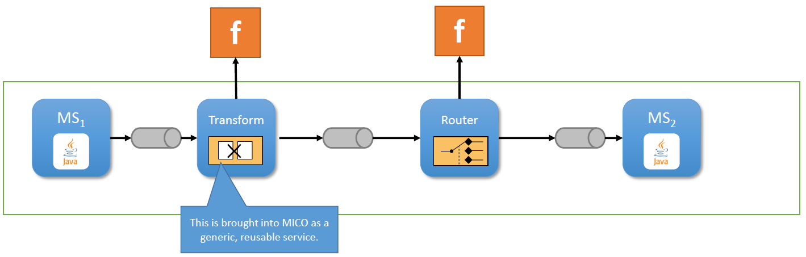
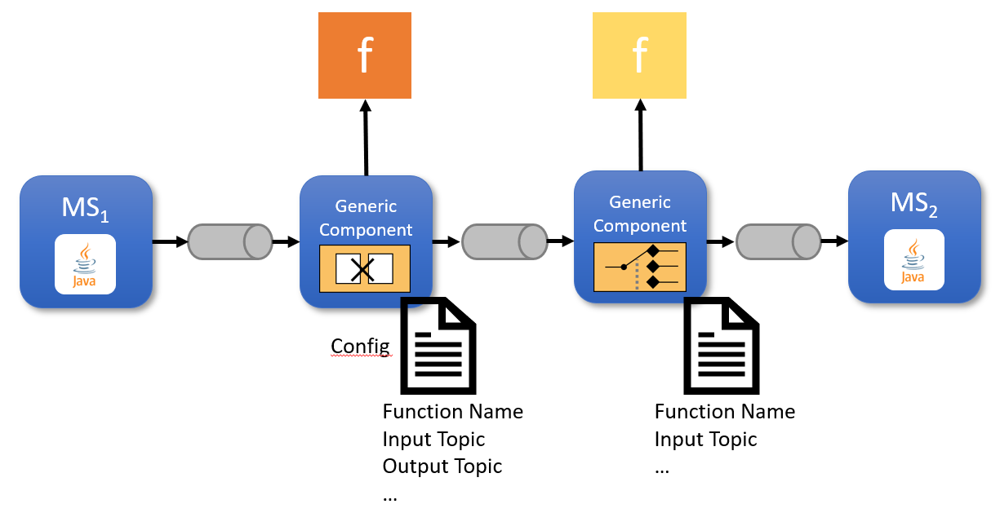
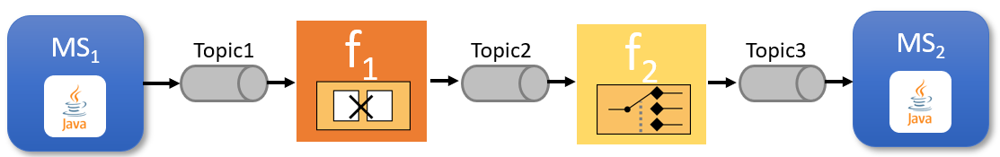

# [WIP] Generic component requirements


Technical Story: [https://github.com/UST-MICO/mico/issues/724]

## Context and Problem Statement

We want to realize the following user story: As a user, I want to connect two components of a distributed app. Both components write/listen to different topics and
use a different message format. 
To realize this, a message router and a message transformer ([EAI Pattern](https://www.enterpriseintegrationpatterns.com/)) is needed as depicted in the following sketch.

The transformation and the routing logic is provided via functions which are hosted on a FaaS solution. This functions are user specific and could be provided via a function store. The transformer doesn't need to know how to transform/split/enrich/filter the messages. It simply reads the message from a specific topic, hands it over to the function and sends the (transformed) result of the function to an output topic. Likewise, the router does not need to know how to route the messages (content or context based, e.g. if `itemPrice>50000` than route to high-value department). It reads the message from a topic, hands it over to a function and sends the message to a function determined topic. Both components have in common that they only read messages from a topic, hand the message to a function and act upon the result. We could draw the image above like this:



## Considered Options

* A generic message processor component
* OpenFaaS Kafka connector

## Decision Outcome

Chosen option: "[option 1]", because [justification. e.g., only option, which meets k.o. criterion decision driver | which resolves force force | … | comes out best (see below)].

## Detailed Option describtion

### Generic message processor component

As described above we could solve this with a generic message processor component which reads messages from an input topic, hands them over to a function and then acts upon the results. This could either be to post the transformed message to an output topic (message transformer) or to send the original message to a function determined output topic (message router). This generic message processor needs the following capabilities:

* Read messages from a Kafka topic
* Call a function hosted on a FaaS solution with a message payload
* Receive zero, one or multiple (splitter) messages from the function
* Call a function with a message payload and receive a topic as a result
* Send messages to a function or configuration determined topic 
* If there was an error during processing, then send the message to an Invalid Message Topic
* If there was an error during routing (topic does not exist), then send the message to a Dead Letter Topic
* TODO State handling for aggregator and other stateful message patterns

### OpenFaaS Kafka connector

In contrast to the generic message processor component approach, we could use the [Kafka connector](https://github.com/openfaas-incubator/kafka-connector) to read messages from topics.
We could transform the first image on the fly into something like this: 

The functions are still user provided but we deploy or update the functions with annotations which contain the input topic (e.g. for f1 we would add `topic=Topic1`). The functions get the output topic via an environment variable or determine it them self (in case of a router). 

**Example function yaml**
```yaml
provider:
  name: openfaas
  gateway: http://127.0.0.1:8080
functions:
  msg-payload-transformer:
    lang: java8
    handler: ./msg-payload-transformer
    image: msg-payload-transformer:latest
    environment:
      output_topic: Topic2
    annotations:
      topic: Topic1
```

Pros and cons:
* Good, because we don't need the generic message processor
* Good, because we save a round trip from the processor to the function
* Bad, because we need to know all used topics beforehand ([Issue #2](https://github.com/openfaas-incubator/kafka-connector/issues/2))
* Bad, because each function has to handle message sending
* Bad, because we mix business logic in functions with messaging logic