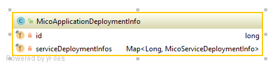
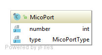
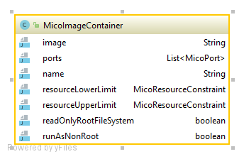
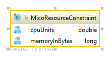
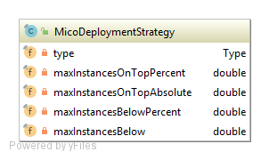

============
Domain Model
============

MicoApplication
===============
Represents an application represented as a set of instances of a `MicoService`_

.. image:: res/MicoApplication.png

*Required fields*

    * services
        List with id's of services the application is composed of.

    * deploymentInfo
        Necessary information for deployment of the application.

MicoApplicationDeploymentInfo
-----------------------------
Represents the information necessary for deploying an application with all services.

*Required fields*

    * serviceDeploymentInfos
        The service deployment information for each service this application is composed of.

MicoService
===========
Represents a service in the context of MICO.

.. image:: res/MicoService.png

*Required fields*

    * shortName
        Brief name for the service intended to be used as unique identifier.

    * name
        Full name of the artifact, intended for humans.

    * version
        Version of this service.

    * description
        Human readable description of this service.

    * serviceInterfaces
        List of interfaces provided by this service.

    * vcsRoot
        The URL to the root directory, e.g. the corresponding GitHub respository.

    * dockerfilePath
        The relative (to vcsRoot) path to the Dockerfile.

*Optional fields*

    * dependencies
        List of services this service requires in order to run normally.

    * contact
        Human readable contact information for support purposes.

    * owner
        Human readable information for the service owner who is responsible for this service.

MicoServiceDeploymentInfo
-------------------------
Represents the information necessary for deploying a single service.

.. image:: res/MicoServiceDeploymentInfo.png

*Required fields*

    * containers
        The list of containers to run within this service.

*Optional fields*

    * replicas
        Number of desired instances. Default is 1.

    * minReadySecondsBeforeMarkedAvailable
         Minimum number of seconds for which this service should be ready without any of its containers crashing, for it to be considered available. Defaults to 0 (considered available as soon as it is ready).

    * labels
        Those labels are key-value pairs that are attached to the deployment of this service. Intended to be used to specify identifying attributes that are meaningful and relevant to users, but do not directly imply semantics to the core system. Labels can be used to organize and to select subsets of objects. Labels can be attached to objects at creation time and subsequently added and modified at any time. Each key must be unique for a given object.

    * imagePullPolicy
        Indicates whether and when to pull the image. Default is Always.

    * restartPolicy
        Restart policy for all containers. Default is Always.

MicoServiceDependency
---------------------
Represents a dependency of a `MicoService`_.

.. image:: res/MicoServiceDependency.png

*Required fields*

    * serviceId
        The id of the dependend service.

    * minVersion
        The minimum version of the depended service that is supported.

    * maxVersion
        The maximum version of the depended service that is supported.

MicoServiceInterface
--------------------
 Represents a interface, e.g., REST API, of a `MicoService`_.

 .. image:: res/MicoServiceInterface.png

*Required fields*

    * serviceId
        The id of the parent service.

    * ports 
        The list of ports.

*Optional fields*

    * publicDns
        The public DNS.

    * description
        Human readable description of this service interface, e.g., the functionality provided.

    * protocol
        The protocol of this interface (e.g. HTTP).

    * transportProtocol
        The transport protocol (e.g. TCP).

MicoServicePort
---------------
Represents a basic port with a port number and port type (protocol).

.. image:: res/MicoServicePort.png

*Required fields*

    * number
        The port number of the externally exposed port.

    * type
        The type (protocol) of the port.

    * targetPort
        The port of the container.

MicoPort
========
Represents a basic port with a port number and port type (protocol).

*Required fields*

    * number
        The port number.
    
    * type
        The type (protocol) of this port. 

MicoImageContainer
==================
Represents a container running in a Kubernetes Pod.

*Required fields*

    * image
        The name of the Docker image. Default is the `MicoService`_ shortname

    * ports 
        The list of `MicoPort`_ for this service.

*Optional fields*

    * name
        The name of the container (in the Kubernetes Pod). Default is `MicoService`_ shortname.

    * resourceLowerLimit
        Limit describing the minimum amount of compute resources allowed. If omitted it defaults to the upper limit if that is explicitly specified.

    * resourceUpperLimit
        Limit describing the maximum amount of compute resources allowed.

    * readOnlyRootFileSystem
        Indicates whether this container should have a read-only root file system. Defaults to false.

    * runAsNonRoot
        Indicates whether the service must run as a non-root user. If somehow not run as non-root user (not UID 0) it will fail to start. Default to false.

MicoResourceConstraint
======================
Represents a resource constraint specifying the CPU units and memory. Can be used as a upper (limiting) and lower (requesting) constraint.

*Required fields*

    * cpuUnits
        Measured in CPU units. One Kubernetes CPU (unit) is equivaletnt to:
            * 1 AWS vCPU
            * 1 GCP Core
            * 1 Azure vCore
            * 1 IBM vCPU
            * 1 Hyperthread on a bare-metal Intel processor with Hyperthreading. 

            Can also be specified as a fraction up to precision 0.001.

    * memoryInBytes
        Memory in bytes.

MicoDeploymentStrategy
======================
The deployment strategy to use to replace an existing `MicoService`_ with new ones.

*Required fields*

    * type
        The type of this deployment strategy, can Recreate or RollingUpdate. Default is RollingUpdate.

    * maxInstancesOnTopPercent
        The maximum number of instances that can be scheduled above the desired number of instances during the update. Value can be an absolute number or a percentage of desired instances. This can not be 0 if maxUnavailable is 0. Absolute number is calculated from percentage by rounding up.If both fields are specified, the percentage will be used. Defaults to 25%.

    * maxInstancesOnTopAbsolute
        The maximum (absolute) number of instances that can be scheduled above the desired number of instances during the update. This can not be 0 if maxUnavailable is 0. If the percentage is also specified, it will be used prior to this absolute number.

    * maxInstancesBelowPercent
        The maximum number of instances that can be unavailable during the update. Value can be an absolute number or a percentage of desired pods. Absolute number is calculated from percentage by rounding down. This can not be 0 if MaxSurge is 0. If both fields are specified, the percentage will be used. Defaults to 25%.

    * maxInstancesBelow
        The maximum (absolute) number of instances that can be unavailable during the update. This can not be 0 if maxSurge is 0. If the percentage is also specified, it will be used prior to this absolute number.
