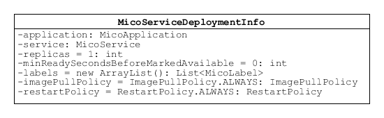

============
Domain Model
============

MicoApplication
===============
Represents an application represented as a set of instances of `MicoService`_

.. image:: res/MicoApplication.png

*Required fields*

    * id
        The id of this application.

    * shortName
        A brief name for the application intended for use as a unique identifier.

    * name
        The name of the artifact. Intended for humans.

    * version
        The version of this application.

    * description
        Human readable description of this application.

*Optional fields*

    * serviceDeploymentInfos
        The list of service deployment information this application uses for the deployment of the required services. Null values are skipped.

    * contact
        Human readable contact information for support purposes.

    * owner
        Human readable information for the application owner who is responsible for this application.

MicoLabel
=========
Represents a simple key-value pair label. Necessary since Neo4j does not allow to persist Map implementations.

.. image:: res/MicoLabel.png

* key
    Key of the label.

* value
    Value of the label.

MicoService
===========
Represents a service in the context of MICO.

.. image:: res/MicoService.png

*Required fields*

    * id
        The id of this service. MUST be readable and writable from the perspective of the Jackson mapper to handle recursive service dependencies.       

    * shortName
        A brief name for the service. In conjunction with the version it must be unique. Pattern is the same as the one for Kubernetes Service names.

    * name
        The name of the artifact. Intended for humans. Required only for the usage in the UI.

    * version
        The version of this service. E.g. the GitHub release tag.

    * description
        Human readable description of this service. Is allowed to be empty (default). Null values are skipped.

    * serviceCrawlingOrigin
        Indicates where this service originates from, e.g., GitHub (downloaded and built by MICO) or DockerHub (ready-to-use image). Null is ignored.

*Optional fields*

    * serviceInterfaces
        The list of interfaces this service provides. Is read only. Use special API for updating.

    * dependencies
        The list of services that this service requires in order to run normally. Is read only. Use special API for updating.

    * predecessor
        Same MicoService with previous version.

    * dependencies
        List of services this service requires in order to run normally.

    * contact
        Human readable contact information for support purposes.

    * owner
        Human readable information for the service owner who is responsible for this service.

    * gitCloneUrl
        The URL that could be used for a git clone, to clone the current master branch.

    * gitReleaseInfoUrl
        The URL to the get the information about a specific git release.
   
    * dockerfilePath
        The relative (to vcsRoot) path to the Dockerfile.

    * dockerImageUri
        The fully qualified URI to the image on DockerHub. Either set after the image has been built by MICO (if the service originates from GitHub) or set by the user directly.

MicoServiceDeploymentInfo
-------------------------
Represents the information necessary for deploying a single service.

*Required fields*

    * containers
        The list of containers to run within this service.

*Optional fields*

    * replicas
        Number of desired instances. Default is 1.

    * minReadySecondsBeforeMarkedAvailable
         Minimum number of seconds for which this service should be ready without any of its containers crashing, for it to be considered available. Defaults to 0 (considered available as soon as it is ready).

    * labels
        Those labels are key-value pairs that are attached to the deployment of this service. Intended to be used to specify identifying attributes that are meaningful and relevant to users, but do not directly imply semantics to the core system. Labels can be used to organize and to select subsets of objects. Labels can be attached to objects at creation time and subsequently added and modified at any time. Each key must be unique for a given object.

    * imagePullPolicy
        Indicates whether and when to pull the image. Default is Always.

    * restartPolicy
        Restart policy for all containers. Default is Always.

MicoServiceDependency
---------------------
Represents a dependency of a `MicoService`_.

.. image:: res/MicoServiceDependency.png

*Required fields*

    * service
        This is the `MicoService`_ that requires (depends on) the `MicoServiceDependency`_ #dependendService.

    *  dependendService
        This is the `MicoService`_ dependend by `MicoService`_ #service.

    * minVersion
        The minimum version of the depended service that is supported.

    * maxVersion
        The maximum version of the depended service that is supported.

MicoServiceInterface
--------------------
 Represents a interface, e.g., REST API, of a `MicoService`_.

 .. image:: res/MicoServiceInterface.png

*Required fields*

    * serviceInterfaceName
        The name of this `MicoServiceInterface`_

    * ports
        The list of ports.

*Optional fields*

    * publicDns
        The public DNS.

    * description
        Human readable description of this service interface, e.g., the functionality provided.

    * protocol
        The protocol of this interface (e.g. HTTP).

    * transportProtocol
        The transport protocol (e.g. TCP).

MicoServicePort
---------------
Represents a basic port with a port number and port type (protocol).

.. image:: res/MicoServicePort.png

*Required fields*

    * number
        The port number of the externally exposed port.

    * type
        The type (protocol) of the port.

    * targetPort
        The port of the container.

MicoPort
========
Represents a basic port with a port number and port type (protocol).

.. image:: res/MicoPort.png

*Required fields*

    * number
        The port number.

    * type
        The type (protocol) of this port.

MicoImageContainer
==================
Represents a container running in a Kubernetes Pod.

.. image:: res/MicoImageContainer.png

*Required fields*

    * image
        The name of the Docker image. Default is the `MicoService`_ shortname

    * ports
        The list of `MicoPort`_ for this service.

*Optional fields*

    * name
        The name of the container (in the Kubernetes Pod). Default is `MicoService`_ shortname.

    * resourceLowerLimit
        Limit describing the minimum amount of compute resources allowed. If omitted it defaults to the upper limit if that is explicitly specified.

    * resourceUpperLimit
        Limit describing the maximum amount of compute resources allowed.

    * readOnlyRootFileSystem
        Indicates whether this container should have a read-only root file system. Defaults to false.

    * runAsNonRoot
        Indicates whether the service must run as a non-root user. If somehow not run as non-root user (not UID 0) it will fail to start. Default to false.

MicoResourceConstraint
======================
Represents a resource constraint specifying the CPU units and memory. Can be used as a upper (limiting) and lower (requesting) constraint.

.. image:: res/MicoResourceConstraint.png

*Required fields*

    * cpuUnits
        Measured in CPU units. One Kubernetes CPU (unit) is equivaletnt to:
            * 1 AWS vCPU
            * 1 GCP Core
            * 1 Azure vCore
            * 1 IBM vCPU
            * 1 Hyperthread on a bare-metal Intel processor with Hyperthreading.

            Can also be specified as a fraction up to precision 0.001.

    * memoryInBytes
        Memory in bytes.

MicoDeploymentStrategy
======================
The deployment strategy to use to replace an existing `MicoService`_ with new ones.

.. image:: res/MicoDeploymentStrategy.png

*Required fields*

    * type
        The type of this deployment strategy, can Recreate or RollingUpdate. Default is RollingUpdate.

*Optional fields*

    * maxInstancesOnTopPercent
        The maximum number of instances that can be scheduled above the desired number of instances during the update. Value can be an absolute number or a percentage of desired instances. This can not be 0 if maxUnavailable is 0. Absolute number is calculated from percentage by rounding up.If both fields are specified, the percentage will be used. Defaults to 25%.

    * maxInstancesOnTopAbsolute
        The maximum (absolute) number of instances that can be scheduled above the desired number of instances during the update. This can not be 0 if maxUnavailable is 0. If the percentage is also specified, it will be used prior to this absolute number.

    * maxInstancesBelowPercent
        The maximum number of instances that can be unavailable during the update. Value can be an absolute number or a percentage of desired pods. Absolute number is calculated from percentage by rounding down. This can not be 0 if MaxSurge is 0. If both fields are specified, the percentage will be used. Defaults to 25%.

    * maxInstancesBelow
        The maximum (absolute) number of instances that can be unavailable during the update. This can not be 0 if maxSurge is 0. If the percentage is also specified, it will be used prior to this absolute number.
