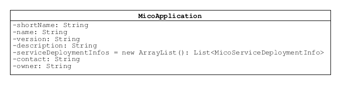
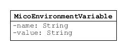
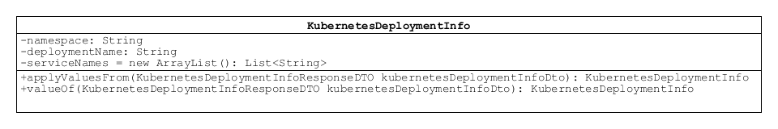
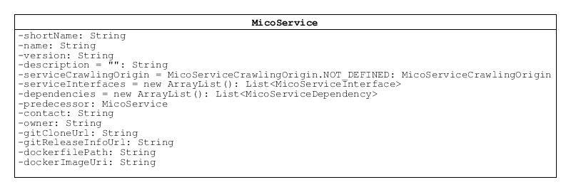
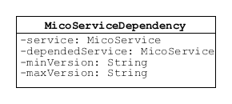
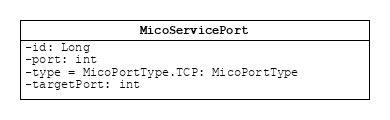
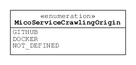

============
Domain Model
============

MicoApplication
===============
Represents an application represented as a set of instances of `MicoService`_

*Required fields*

    * id
        The id of this application.

    * shortName
        A brief name for the application intended for use as a unique identifier.

    * name
        The name of the artifact. Intended for humans.

    * version
        The version of this application.

    * description
        Human readable description of this application.

*Optional fields*

    * serviceDeploymentInfos
        The list of service deployment information this application uses for the deployment of the required services. Null values are skipped.

    * contact
        Human readable contact information for support purposes.

    * owner
        Human readable information for the application owner who is responsible for this application.

MicoApplicationJobStatus
========================
Represents the job status for a `MicoApplication`_. Contains a list of jobs.

* applicationShortName
    The short name of the application.

* applicationVersion
    The version of the application.

* status
    The aggregated status of jobs for the `MicoApplication`_.

* jobs 
    The list of jobs for the `MicoApplication`_.

MicoEnvironmentVariable
=======================
An environment variable represented as a simple key-value pair. Necessary since Neo4j does not allow to persist properties of composite types.

* name
    Name of the environment variable.

* value
    Value of the environment variable.

MicoServiceBackgroundJob
========================
Background job for a `MicoService`_.

* future
    The actual job future.

* serviceShortName
    The short name of the corresponding `MicoService`_.

* serviceVersion
    The version of the corresponding `MicoService`_.

* type 
    The type of this job.

* status
    The current status of this Job.

* errorMessage
    An error message in case the job has failed.

KubernetesDeploymentInfo
========================
Information about the Kubernetes resources that are created through an actual deployment of a `MicoService`_.

* namespace
    The namespace in which the Kubernetes deployment is created.

* deploymentName
    The name of the Kubernetes deployment created by a `MicoService`_.

* serviceNames
    The names of the Kubernetes services created by `MicoServiceInterface`_.

MicoLabel
=========
Represents a simple key-value pair label. Necessary since Neo4j does not allow to persist Map implementations.

* key
    Key of the label.

* value
    Value of the label.

MicoService
===========
Represents a service in the context of MICO.

*Required fields*

    * id
        The id of this service. MUST be readable and writable from the perspective of the Jackson mapper to handle recursive service dependencies.       

    * shortName
        A brief name for the service. In conjunction with the version it must be unique. Pattern is the same as the one for Kubernetes Service names.

    * name
        The name of the artifact. Intended for humans. Required only for the usage in the UI.

    * version
        The version of this service. E.g. the GitHub release tag.

    * description
        Human readable description of this service. Is allowed to be empty (default). Null values are skipped.

    * serviceCrawlingOrigin
        Indicates where this service originates from, e.g., GitHub (downloaded and built by MICO) or DockerHub (ready-to-use image). Null is ignored.

*Optional fields*

    * serviceInterfaces
        The list of interfaces this service provides. Is read only. Use special API for updating.

    * dependencies
        The list of services that this service requires in order to run normally. Is read only. Use special API for updating.

    * predecessor
        Same MicoService with previous version.

    * dependencies
        List of services this service requires in order to run normally.

    * contact
        Human readable contact information for support purposes.

    * owner
        Human readable information for the service owner who is responsible for this service.

    * gitCloneUrl
        The URL that could be used for a git clone, to clone the current master branch.

    * gitReleaseInfoUrl
        The URL to the get the information about a specific git release.
   
    * dockerfilePath
        The relative (to vcsRoot) path to the Dockerfile.

    * dockerImageUri
        The fully qualified URI to the image on DockerHub. Either set after the image has been built by MICO (if the service originates from GitHub) or set by the user directly.

MicoServiceDependency
---------------------
Represents a dependency of a `MicoService`_.

*Required fields*

    * id
        The id of this service dependency.
    
    * service
        This is the `MicoService`_ that requires (depends on) the depended service.

    * dependedService
        This is the `MicoService`_ depended by this service.

    * minVersion
        The minimum version of the depended service that is supported.

    * maxVersion 
        The maximum version of the depended service that is supported.

MicoServiceDeploymentInfo
-------------------------
Represents the information necessary for deploying a single service.

.. image:: res/MicoServiceDeploymentInfo.png

*Required fields*

    * id
        The id of this service deployment info.

    * application
        The `MicoApplication`_ that uses a `MicoService`_ this deployment refers to.

    * service
        The `MicoService`_ this deployment refers to.

*Optional fields*

    * replicas
        Number of desired instances. Default is 1.

    * minReadySecondsBeforeMarkedAvailable
         Minimum number of seconds for which this service should be ready without any of its containers crashing, for it to be considered available. Defaults to 0 (considered available as soon as it is ready).

    * labels
        Those labels are key-value pairs that are attached to the deployment of this service. Intended to be used to specify identifying attributes that are meaningful and relevant to users, but do not directly imply semantics to the core system. Labels can be used to organize and to select subsets of objects. Labels can be attached to objects at creation time and subsequently added and modified at any time. Each key must be unique for a given object.

    * imagePullPolicy
        Indicates whether and when to pull the image. Default is Always.

    * restartPolicy
        Restart policy for all containers. Default is Always.

MicoServiceInterface
--------------------
 Represents a interface, e.g., REST API, of a `MicoService`_.

 .. image:: res/MicoServiceInterface.png

*Required fields*

    * id
        The id of this service interface.

    * serviceInterfaceName
        The name of this `MicoServiceInterface`_. Pattern is the same than for Kubernetes Service names.

    * ports
        The list of ports. Must not be empty.

*Optional fields*

    * publicDns
        The public DNS.

    * description
        Human readable description of this service interface, e.g., the functionality provided.

    * protocol
        The protocol of this interface (e.g. HTTP).

    * transportProtocol
        The transport protocol (e.g. TCP).

MicoServicePort
---------------
Represents a basic port with a port number and port type (protocol).

*Required fields*

    * id
        The id of this service port.

    * port
        The port number of the externally exposed port.

    * type
        The type (protocol) of the port. Default port type is MicoPortType.TCP.

    * targetPort
        The port inside the container.

MicoPortType
------------
Enumeration for all port types, e.g., TCP, supported by MICO.

* TCP
    Transmission Control Protocol.

* UDP
    User Datagram Protocol.

MicoServiceDeploymentInfoQueryResult
------------------------------------

.. image:: res/MicoServiceDeploymentInfoQueryResult.png

* application

* serviceDeploymentInfo

* service

MicoServiceInterfaceConnection
------------------------------
An interface connection contains the the information needed to connect a `MicoService`_ to an `MicoServiceInterface`_ of another `MicoService`_.

* environmentVariableName
    Name of the environment variable that is used to set the fully qualified name of an interface.

* micoServiceInterfaceName
    Name of the `MicoServiceInterface`_ of another `MicoService`_.

* micoServiceShortName
    Name of the `MicoService`_.

MicoServiceCrawlingOrigin
=========================
Enumeration for the various places a service may originate from.

* GITHUB
    Indicates that a service originates from some GitHub respository.

* DOCKER
    Indicates that a service originates from Docker.

* NOT_DEFINED
    Undefined.

MicoVersion
===========
Wrapper for a version that adds the functionality for a version prefix, so that versions like, e.g., 'v1.2.3' are possible.

* prefix
    String prefix of this version, e.g., 'v'.

* version
    The actual semantic version.

* valueOf(String version)
    Creates a new instance of MicoVersion as a result of parsing the specified version string. 
    Prefixes are possible as everything before the first digit in the given version string is treated as a prefix to the actual semantic version. 
    Note that the prefix can only consist of letters.

* forIntegers(int major, int minor, int patch)
    Creates a new instance of MicoVersion for the specified version numbers.

* forIntegersWithPrefix(String prefix, int major, int minor, int patch)
    Creates a new instance of MicoVersion for the specified version numbers with the specified prefix string.