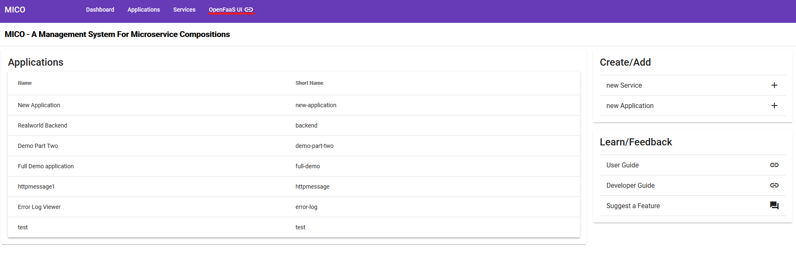
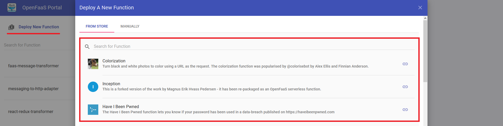

# OpenFaaS

## Installation

We use the YAML files of the GitHub repository [openfaas/faas-netes](https://github.com/openfaas/faas-netes) for the installation of OpenFaaS modified for our use with the monitoring of other components.

Install it:
```bash
kubectl apply -f install/kubernetes/openfaas
```

## Function deployment

The fastest method to deploy a function is to use the OpenFaaS Function Store via the OpenFaaS UI. To deploy a custom function the OpenFaaS CLI is necessary. Both methods are described in the following sections.

### Function Store

1. To open the OpenFaaS UI use the button provided in the MICO UI. 



The necessary credentials are configured in the [setup script](https://github.com/UST-MICO/mico/blob/master/install/kubernetes/setup.sh). The default username is admin.

2. After the login is completed the UI offers the 'Deploy A New Function' button. 
The button opens a list and it is possible to select a function from the store.



3. After selecting a function, use the 'Deploy' button on the bottom of the list.

### Custom Function

To build and deploy a custom function the following requirements are necessary:
- Kubectl must be configured (See the previous sections)
- Docker Hub account
- Docker

This tutorial is tested on windows. It should work on Linux too. All commands are tested in Powershell but should also work in the Git Bash.

1. Install OpenFaaS CLI:
    1. Download the FaaS CLI from [here](https://github.com/openfaas/faas-cli)
    2. (Optional) Point the path variable in windows to the directory of the faas-cli.exe
    3. In case of a problem read the readme from the download page. 
2. Configure the Docker Hub account in Docker (Docker Icon in Taskbar):
    1. Right-click docker icon in the taskbar
    2. Select Sign in
    3. Enter credentials
3. Start the port forwarding with kubectl `kubectl port-forward svc/gateway -n openfaas 8080` 
4. Log in with the faas CLI `faas-cli login --password PASSWORD`
5. `faas-cli list` should now provide a list of all deploy functions
6. Change into the directory of a function (The root of a function contains the file stack.yml or `<function-Name>.yml`)
7. Edit the yaml file (Not always necessary):
    1. The attributes `provider` and `gateway` should have the values `openfaas` and `http://127.0.0.1:8080` (Different values are possible for the gateway if for example no port forwarding is used)
    2. The attribute `image` should have the prefix of the Docker Hub account/organization name (e.g. "ustmico")
8. Use `faas-cli up` (up = build, push, deploy) if the yaml file has the name stack.yaml or `faas-cli up -f function-name.yml` if the yaml file has a custom name. (e.g. "faas-cli up -f messaging-to-http-adapter.yml")
9. Use the function (Look up the URL and other parameters in the OpenFaaS UI)


**Troubleshooting**
- If the deployment fails, check of the port forwarding is still running. It tends to break often.
- If the build fails, check if all files have Linux line endings (including the stack.yml)
- If the push fails, check if the DockerHub account is configured correctly
- If something else breaks read the OpenFaaS documentation or tutorials.

Example functions are located in our custom functions [repository](https://github.com/UST-MICO/OpenFaasFunctions)


### Function Development

The development of functions is different for each programming language. But it is recommended to use a template for the language from [here](https://github.com/openfaas/templates). The templates are also accessible from the OpenFaaS CLI with faas-cli new (e.g. `faas-cli new <function-name> --lang java8`)

### Further information

* [Website](https://www.openfaas.com/)
* [Tutorial](https://docs.openfaas.com/deployment/kubernetes/)
* [OpenFaaS Doc](https://docs.openfaas.com/)
* [REST API](https://raw.githubusercontent.com/openfaas/faas/master/api-docs/swagger.yml)
